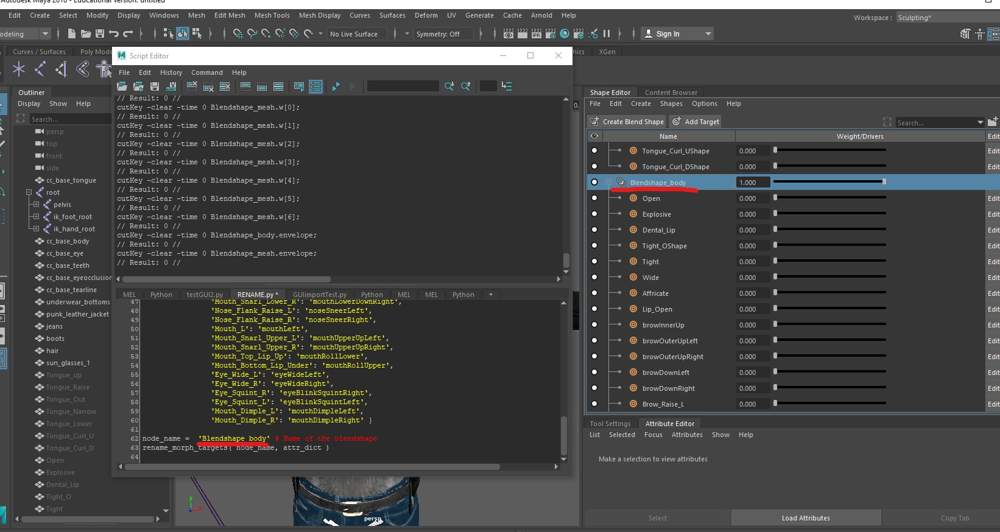

# Software that should be downloaded already before these steps
 * Maya student version download here: https://www.autodesk.com/education/free-software/maya
 * Unreal downloaded here: https://www.unrealengine.com/en-US/get-now/agnostic
 
 
 **Reallusion to Maya**
	  -  Import the FBX into Maya. Choose the "Sculpting" layout from the top right "Workspaces" dropdown menu. It will change the layout of Maya to bring up the Blendshapes. This is a screenshot of what the blendshapes will come out as when you open the Reallusion FBX file in Maya. You can drag the sliders for each shape and see how it affects the face mesh.
	


   - After the import is done, you see all the blendshape names and will have key frames selected on some of them.
	  - In Maya, make sure the workspace name should open as "sculpting""
	  - If you want to turn of the red dots, you can select all the blendshapes and right click on the red button and select "remove key frame" 
	 
	 


  
When you select the blendshape targets you can move the sliders back and forth and you will be able to see eye’s blinking and the mouth opening and closing. On the right, you will need to rename the blendshape group of “CC3_Base_Body_ncl1_1” to Blendshape_[ name of mesh]. 


   - **Merging Blendshapes in Maya:**
	  - There are two blendshapes that need to be merged and one renamed  in maya, first, you need to identify.
	  - Brow_Raise_Inner_L and Brow_Raise_Inner_R.
	  - Cheek_Blow_L and Cheek_Blow_R.
	  - Mouth_Blow

Once you can see all the blendshapes, shown in the previous picture, scroll all the way down look for three types.


In this example picture you want to select both the Left and Right blendshapes. Be sure to drag the toggles all the way to the right and select both Left and Right blendshapes and right click into one of them and select merge targets. Once it is merged you need to find the name again, and rename it to **browInnerUp**, the name has to be exact!

   - **Repeat the process for all three, then rename the merged blendshape to the names in bold:**
	 - Brow_Raise_Inner_L and Brow_Raise_Inner_R = **browInnerUp**
	 - Mouth_Blow = **mouthPucker**
	 - Cheek_Blow_L and Cheek_Blow_R = **cheekPuff**

   - Here are some screenshots for reference


# Running the script in Maya
This step is after you completed designing your 3D character in your specific software of your choosing. 

# Using Python in Maya
There are no plugins required for this step. To use this script you want to open Maya and open the script editor at the bottom right. 


Once you have the window open, select the python tab. If you do not see one, hit the "+" and choose python and the tab will have the label Python. 

Now once you name your blendshape group is changed to "Blendshape_mesh" and all the necessary targets are merged you can run our script!


# Running Python

Once you open the script editor there should be a MEL tab and a Python tab. If not you can hit the "+" on the far right of the tabs and select "Python". Open the Python tab and just copy and paste the code below into the maya script editor


Then scroll all the down the code until you see a some yellow and red words, please refer to the screenshot below.


Next, you want insert the "Blendshape_whatever" name in between the '' after you type in the name, you can hit the execute all button at the top.


Once the code executes, the specific target blendshapes should have changed to camel case naming convention.

Like so in this screenshot. 



**Now scroll all the way down this page to see the next steps!**
------------------------------------------------------------------------------------------------------------------------------------------------------------------------

```Python
import maya.cmds

def rename_morph_targets( node_name, attr_dict, quiet = False ):
	# list to catch our failures	
	fail_list = [ ]

	# How many targets there are in the alias list
	number_of_targets = maya.cmds.getAttr( '{0}.weight'.format( node_name ), size = True )

	# Iterate through the weight list
	for index in range( 0, number_of_targets ):
		# Query the name of the current blendshape weight
		old_name = maya.cmds.aliasAttr( '{0}.weight[{1}]'.format( node_name, index ), query = True )

		# If the old name isn't in the attr_dict, we're going to pass on it.
		if old_name in attr_dict.keys( ):
			# We're going to rename
			new_name = attr_dict[ old_name ]
			print 'Found old name: ', index, new_name, old_name
			
			absolute_name = '{0}.weight[{1}]'.format( node_name, index )

			maya.cmds.aliasAttr( new_name, absolute_name ) # Re-aliasing / Renaming occurs here.
			if not quiet:
				print 'Changed {0} -> {1}'.format( old_name, new_name )
				
		# Add the failure to the fail list		
		else:
			fail_list.append( old_name )

	if fail_list:
		maya.cmds.warning( '{0} names were not changed. Check console for details'.format( len( fail_list ) ) )
		for name in fail_list:
			print name

attr_dict = { 'Eye_Blink_L': 'eyeBlinkLeft',
                'Brow_Drop_L': 'browDownLeft',
                'Eye_Blink_R': 'eyeBlinkRight',
                'Brow_Drop_R': 'browDownRight',
                'Brow_Raise_Outer_L': 'browOuterUpLeft',
                'Brow_Raise_Outer_R': 'browOuterUpRight',
                'Mouth_Frown_L': 'mouthFrownLeft',
                'Mouth_Frown_R': 'mouthFrownRight',
                'Merged_Open_Mouth': 'jawOpen',
                'Mouth_Lips_Tight': 'mouthClose',
                'Mouth_Snarl_Lower_L': 'mouthLowerDownLeft',
                'Mouth_Snarl_Lower_R': 'mouthLowerDownRight',
                'Nose_Flank_Raise_L': 'noseSneerLeft', 
                'Nose_Flank_Raise_R': 'noseSneerRight',
                'Mouth_L': 'mouthLeft',
                'Mouth_Snarl_Upper_L': 'mouthUpperUpLeft',
                'Mouth_Snarl_Upper_R': 'mouthUpperUpRight',
                'Mouth_Top_Lip_Up': 'mouthRollLower',
                'Mouth_Bottom_Lip_Under': 'mouthRollUpper',
                'Eye_Wide_L': 'eyeWideLeft',
                'Eye_Wide_R': 'eyeWideRight',
                'Eye_Squint_R': 'eyeBlinkSquintRight',
                'Eye_Squint_L': 'eyeBlinkSquintLeft',
                'Mouth_Dimple_L': 'mouthDimpleLeft', 
                'Mouth_Dimple_R': 'mouthDimpleRight' }

node_name = '' # Name of Blendshape_whatever blendshape
rename_morph_targets( node_name, attr_dict )
```

------------------------------------------------------------------------------------------------------------------------------------------------------------------------


# The next steps are [here](https://github.com/RLabNYC/Rlab_FaceTracking_reallusion/blob/master/IMPORTING.md)

## If you need to go back to the table of [contents](https://github.com/RLabNYC/RLab_Facetracking). For the reallusion modeling steps go [here](https://github.com/RLabNYC/Rlab_FaceTracking_reallusion/blob/master/README.md)
